# Untitled

**Voron Design SKR 1.3 Setup Guide**

[Power Supply Wiring 1]()

[Safety Note 1]()

[Damage Risk 1]()

[DC Power Supply Wiring 1]()

[Using non-24V fans for 24V powered SKR 1]()

[SKR 1.3 Board Configuration 2]()

[Jumper Configuration 2]()

[Stepper Driver Installation 2]()

[Wire Terminals 3]()

[Inductive Probe Wiring 3]()

[Endstop Wiring 4]()

[MCU 1 Wiring \(X, Y, E, Hot End\) 5]()

[MCU Z Wiring \(Z, Bed, Exhaust Fan\) 6]()

[Klipper Installation 8]()

[Installing Klipper Firmware on your SKR 1.3 Boards 8]()

[Configuring Octoprint to use Klipper 10]()

[Setting up Voron Printer Configuration FIle 10]()

[Common Klipper Errors 12]()

[Klipper Troubleshooting 12]()

[Klipper Configuration Checks 13]()

[Endstop Check 13]()

[Stepper Motor Check 13]()

[XY Homing Check 13]()

[Define \(0,0\) Point 14]()

[Z Endstop Pin Location Definition 15]()

[Probe Check 15]()

[Probe Accuracy 15]()

[Quad Gantry Leveling \(or Z Tilt\) 15]()

[PID Tune Heated Bed 16]()

[PID Tune Hotend 16]()

[Running Quad Gantry Level with Hot Chamber 16]()

[Z Offset Adjustment 16]()

[Extruder Calibration 17]()

[Fine Tuning Z Height 17]()

[Slicer Setup and First Print 18]()

[Cura Installation 18]()

[First Print 18]()

[Appendix 19]()

[Appendix 1 - Notepad++ Configuration Editing \(Windows\) 19]()

[Appendix 2 - bbEdit Configuration Editing \(macOS\) 19]()

[Appendix 3 - Recommended Octoprint Plugins 20]()

[Appendix 5 - Other Accessories 20]()

[Appendix 6 - Contributors 20]()

## Power Supply Wiring

### Safety Note

When wiring up your printer electronics, you will be working with high voltage wiring. Always double check to make sure that the printer is unplugged and any capacitors in your power supplies have discharged before touching any wire or terminal that may be live.

### Damage Risk

**Never plug or unplug any device \(high or low voltage\) while the the printer is powered.** In addition to being a safety hazard, you will likely damage electronic components. Of particular note are stepper drivers which can easily be damaged by connecting or disconnecting stepper motors or drivers while powered.

### DC Power Supply Wiring

The latest generation of Voron printers spec the use of two or more independent DC power supplies

* 12V/24V Power Supply for SKR 1.3 board \(24V recommended\)
* 5V DC Power Supply for Raspberry Pi
* 12V \(Optional\) for any other devices \(Fans, LEDs, etc\)

**Important!** Connect the DC 0V output \(labeled -V\) of all of your DC power supplies together so they have the same reference. If you do not do this, you may have issues \(devices may not turn on when they are supposed to, or they may be damaged due to exceeding voltage limits\).

### Using non-24V fans for 24V powered SKR

It is possible to use the SKR 1.3 to control fans, LEDs, and other devices even when those devices do not use 24V. The SKR 1.3, like most controllers, use the \(-\) pin to control if a device is switched on or off.

This means that if you wire the +V side of your fan to an external power supply \(5V for a 5V fan, 12V to a 12V fan, etc\) and connect the -V side of your fan to a \(-\) pin on the SKR 1.3, you can switch the fan on and off. As mentioned above, this _only_ will work if you tie the DC 0V of both power supplies together. Note, in the diagram below, only DC wires are shown. Red represents +V, and Black represents 0V.


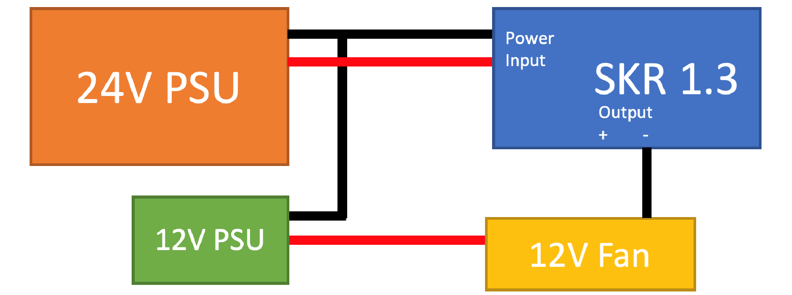

## SKR 1.3 Board Configuration

### Jumper Configuration

For both SKR 1.3 boards with TMC 2208 or TMC 2209 drivers:

* Remove the four jumpers from below the drivers on all boards
* Put single jumper for each driver's UART connection
* Remove all jumpers from end stop pins
* Make sure power jumper is between INT and +5V \(should be default from factory\). If this is not installed correctly you may have power issues with your Raspberry Pi which can cause throttling.

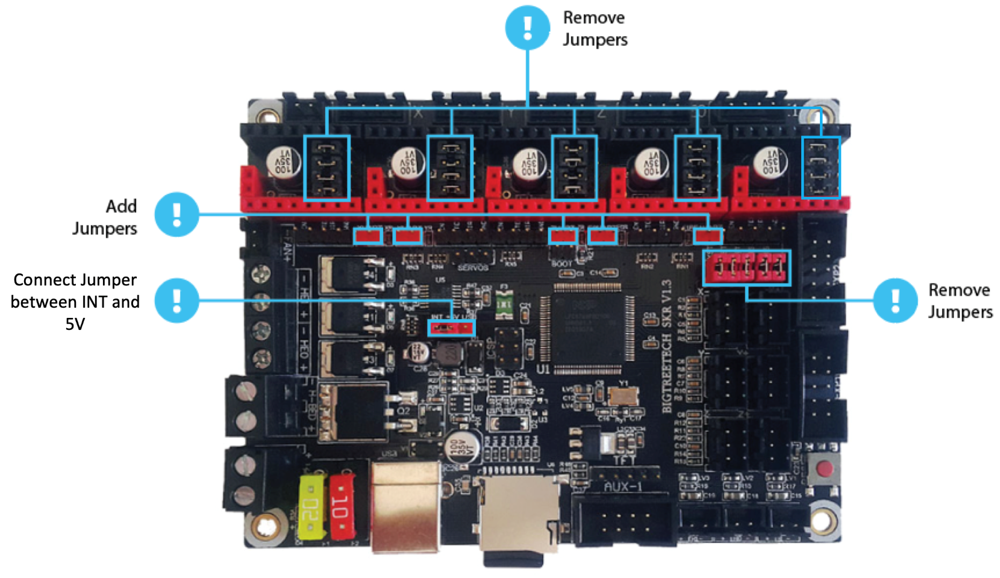

### Stepper Driver Installation

* **Warning!** Always be sure to orient drivers correctly when installing. If you plug the drivers in backwards, they may permanently be damaged. Enable \(EN\) and Direction \(DIR\) pins should both be on the side closest to the microcontroller and the side OPPOSITE the plug that the stepper motor connects to. Another way of orienting the drivers is to make sure the red plastic shown below should align with the red pins on your SKR board. The orientation shown below on the left is correct for TMC 2209 drivers relative to the image above.
* Place included heatsink on top of stepper driver copper pad and provide adequate cooling during operation or you may experience layer shifts or other undesirable behaviors. This is even more important with TMC 2208s as they have higher RDSon and generate more heat for the same stepper motor current.
* **Note:** if you do not have BigTreeTech TMC2209s, the pinout is different. See link [here](https://www.anet3d-forum.de/viewtopic.php?f=82&t=4776)

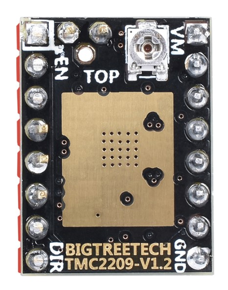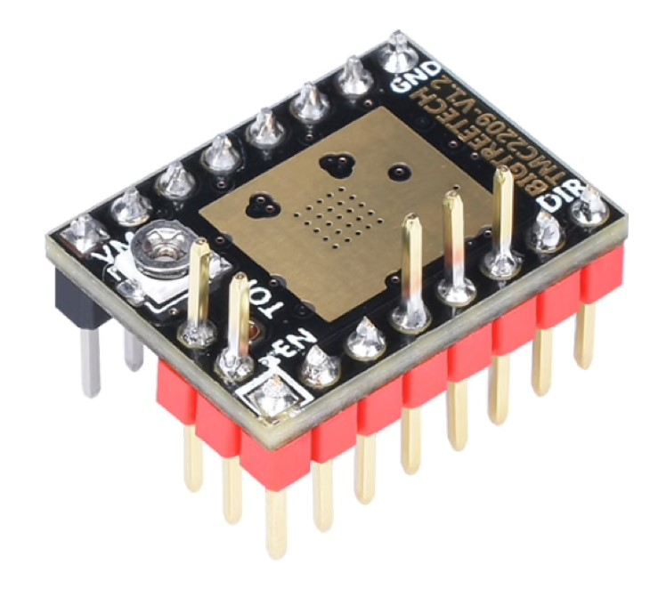

### Wire Terminals

One key difference between RAMPS 1.4 boards and the SKR 1.3 is that RAMPS boards use Dupont terminals, but SKR 1.3 boards use JST-XH terminals. This will mean that you will need to purchase a JST-XH connector kit with 2 pin \(thermistor and fan\), 3 pin \(endstop\), and 4 pin \(stepper motor\) connectors. Unlike Dupont connectors, JST-XH terminals are keyed and will only fit in one orientation so pay close attention while crimping to make sure you do not make a mistake.

For wiring the stepper motors, keep the same wire color sequence that your stepper motors came with and make sure you use the same sequence for all of your stepper motors. If you have the spec motors from StepperOnline, the wires should in the the color order shown in the SKR 1.3 wiring diagrams on the following pages.

**Important:** If you find out your motors are going the wrong way once you start up your printer for the first time, you do not need to repin your connectors. You can invert the DIR \(direction\) pins in your configuration by adding or removing ! in front of pin and it will work properly.

### Inductive Probe Wiring

The PL-08N inductive probe that is used for Z Tilt Adjust \(V1\) or Quad Gantry Leveling \(V2\) needs to be powered with 12-24V, not the standard 5V that is used for typical end stop switches. This is critical because if it is powered with 5V its sense distance will be so low that the nozzle will crash in to the build surface.

The issue with this is that the output signal from the sensor is approximately the same voltage as the sensor is powered with. This means if you power the sensor with 24V, it will send 24V to a pin on the micro that is supposed to never have more than 5V applied to it. This is where the BAT85 diode comes in to play. It is oriented so that when the probe signal wire is HIGH \(12-24V\), no current will flow to the SKR input pin, so the SKR pin will read HIGH voltage due to the internal pull-up resistor. If the probe signal is LOW \(0V\), current will flow from the SKR board through the diode, through the Probe to GND, which will pull the SKR pin LOW. Below is a circuit diagram explaining this:

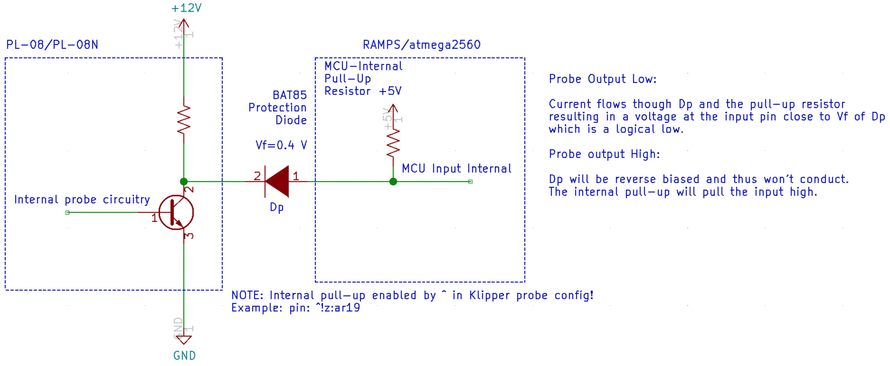

### Endstop Wiring

There are two ways of wiring your endstops, one is NC \(normally closed\) and the other is NO

\(normally open\). For normally closed configurations, the endstop switch allows current to flow through it when it is not triggered. For normally open configurations, the end stop switch only allows current to flow through it when it is triggered.

While both of these configurations will work fine in an ideal world, NC configurations are more robust because if a wire breaks or a terminal becomes disconnected, the printer will think that the end stop has triggered and the printer will stop movement before the toolhead crashes in to the frame or the bed.

Wiring mechanical end stop switches for NC operation is easy, as they generally have three pins exposed. With a multimeter, probe each combination of the three pins until you find a pair that has continuity \(0 ohm resistance\) when the switch is not triggered, but does not have continuity \(infinite resistance\) when the switch is triggered. The outer two pins are often the NC pins, but verify prior to installation.

For the inductive probe, you will need to make sure that you purchase a NC probe, not a NO probe. You cannot change the configuration of the probe—it comes fixed from the factory in a specific configuration. If you happen to receive a NO probe it will still work but you may risk crashing the nozzle in to the bed if a wire breaks.

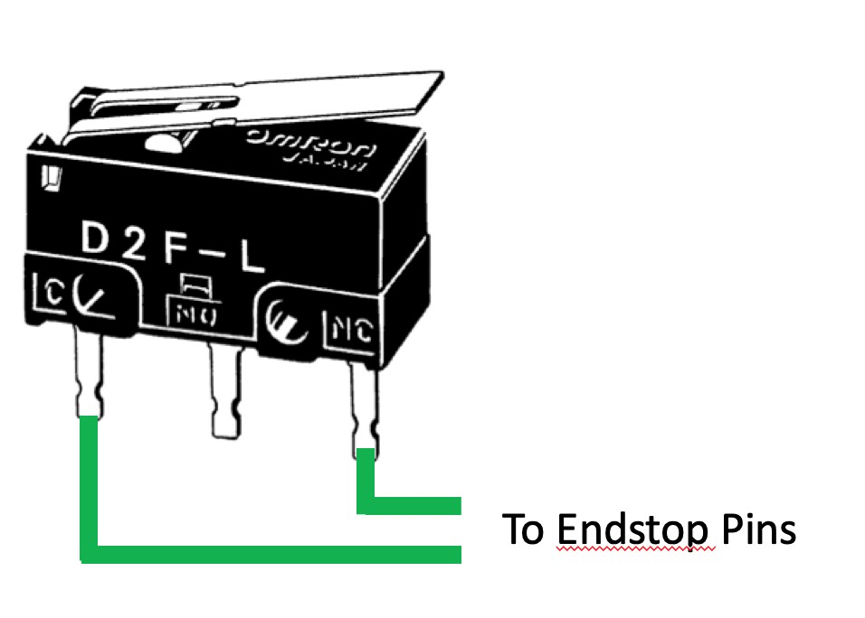

### MCU 1 Wiring \(X, Y, E, Hot End\)

* Place stepper drivers for X, Y, and E in positions X, Y, and E0
* Plug in stepper motors for X, Y, and E in positions X, Y, and E0
* Plug Hot End thermistor to thermistor TH0 \(P0.24\)
* Plug Hot End heater in to HE0 \(P2.7\)
* Plug Hot End Fan in to HE1 \(P2.4\)
* Plug Part Cooling Fan in to Fan \(P2.3\)
* Connect X end stop to +X connector \(P1.28\)
* Connect Y end stop to +Y connector \(P1.26\)
* Wire 24V and 0V from DC power supply to Power In
* Connect USB Cable to your SKR 1.3, but do not connect it yet to your Raspberry Pi

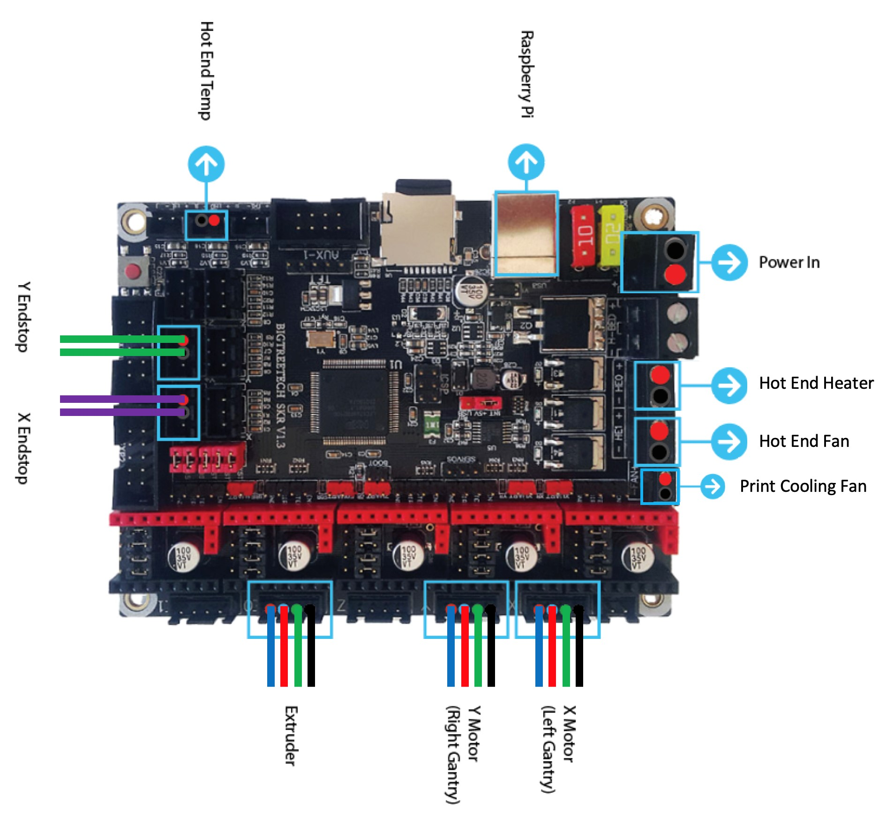

Note: Do not follow jumper positions shown in this image, refer to Page 2


### MCU Z Wiring \(Z, Bed, Exhaust Fan\)

* Place stepper drivers for Z0, Z1, Z2, and Z3 into positions X, Y, Z, and E0
* Plug in stepper motors for Z0, Z1, Z2, and Z3 into positions X, Y, Z, and E0
* Plug Bed Heater Temp in to TB \(P0.23\)
* Plug in Exhaust Fan in to HE0 \(P2.7\)
* Plug in Controller Fan in to HE1 \(P2.4\)
* Plug SSR Control for Heated Bed in to Fan \(P2.3\)
* Plug Z Endstop Switch into -Z \(P1.25\)
* Plug Probe GND and Signal \(with BAT85 diode\) in to +Z \(P1.24
* Plug display wires in to EXP1 and EXP2
* Wire 24V and 0V from DC power supply to Power In
* Connect USB Cable to your SKR 1.3, but do not connect it yet to your Raspberry Pi

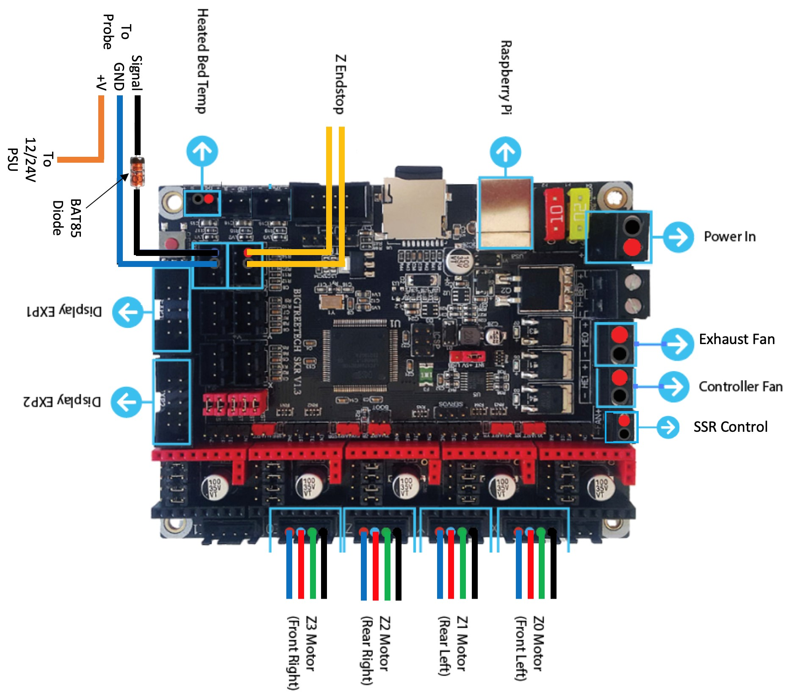

Note: Do not follow jumper positions shown in this image—refer to Page 2


## Klipper Installation

References: [Klipper Installation Instructions](https://github.com/KevinOConnor/klipper/blob/master/docs/Installation.md) [SKR Installation Instructions](https://3dprintbeginner.com/install-klipper-on-skr-1-3-speed-up-your-prints/)

### Installing Klipper Firmware on your SKR 1.3 Boards

* Install OctoPi on your Raspberry Pi \(guide here: [https://octoprint.org/download/](https://octoprint.org/download/)\)
* Once it is installed, ssh in to your Raspberry Pi using [PuTTY](https://www.chiark.greenend.org.uk/~sgtatham/putty/) on Windows or the Terminal on macOS

ssh pi@octopi OR ssh pi@192.168.1.X \(Or whatever ip address your Raspberry Pi has\)

* Enter password, the default one is “raspberry”. It is recommended to change this for security using sudo raspi-config

Change the password via “Change User Password”

* Once you are at the command line of the Raspberry Pi, run the following commands:

git clone https://github.com/KevinOConnor/klipper

./klipper/scripts/install-octopi.sh

* When the install script has completed, run the following commands:

cd ~/klipper/

make menuconfig

In this menu structure, you’ll want to pick a few things. Make sure your Micro-controller Architecture is LPC176x, and your processor model is the lpc1768 with 100Mhz.

When your configuration matches the image below, select Exit and “Yes” if you are asked to save the configuration.

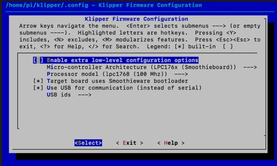

In the terminal window, type the following and pressing enter after each:

make clean make

This command creates a firmware file **klipper.bin** that is stored in the folder /home/pi/klipper/out. The file needs to be copied to both of your SKR 1.3 boards. The easiest way to do this is to use a program like [WinSCP](https://winscp.net/eng/download.php) \(Windows\) or [Cyberduck](https://cyberduck.io/) \(Mac\) to copy the file to your computer via SFTP. See the image on the next page that shows SFTP via Cyberduck.

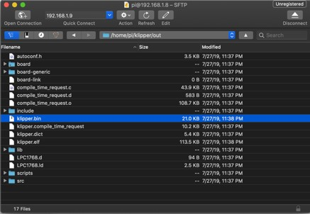

* Copy the **klipper.bin** file to your desktop, and rename the file **firmware.bin**

Make sure both SKR 1.3 boards are not powered, and then remove the microSD cards that are connected to them.

* Connect one of the microSD cards to your computer and open it.

There will be a file named **firmware.cur** on it—you can delete that file or keep it there, it does not matter.

* Copy the **firmware.bin** file from your desktop to the microSD card. If you have trouble transferring files from your computer to the microSD card, reformat the microSD card with a FAT32 file system and then try again.

Once you have one microSD card with **firmware.bin** on it, repeat the process with the other microSD card from your second SKR 1.3.

* Plug the microSD cards back in to your SKR 1.3 boards—it does not matter which microSD card goes in to which SKR 1.3, as both have identical firmware.
* Turn on your power supply to power up your SKR 1.3 boards

**Important:** If you do not power your SKR with 12-24V, Klipper will be unable to communicate with the TMC drivers via UART and it will automatically shut down.

### Configuring Octoprint to use Klipper

Reference: [KevinOConnor - klipper/docs/Installation.md](https://github.com/KevinOConnor/klipper/blob/master/docs/Installation.md#configuring-octoprint-to-use-klipper)

The OctoPrint web server needs to be configured to communicate with the Klipper host software.

Using a web browser, login to the OctoPrint web page and then configure the following items:

* Navigate to the Settings tab \(the wrench icon at the top of the page\)
* Under "Serial Connection" in "Additional serial ports" add "/tmp/printer" then click "Save"
* Open Settings tab and under "Serial Connection" change the "Serial Port" setting to "/tmp/printer"
* In the Settings tab, navigate to the "Behavior" sub-tab and select the "Cancel any ongoing prints but stay connected to the printer" option, then click “Save”
* From the main page, under the "Connection" section \(at the top left of the page\) make sure the "Serial Port" is set to "/tmp/printer" and click "Connect". \(If "/tmp/printer" is not an available selection then try reloading the page\)
* Once connected, navigate to the "Terminal" tab and type "status" \(without the quotes\) into the command entry box and click "Send". The terminal window will likely report there is an error opening the config file - that means OctoPrint is successfully communicating with Klipper.

### Setting up Voron Printer Configuration FIle

* Download the respective Voron configuration file from the following link \(or attached with this file\): [https://github.com/VoronDesign/Voron-2/tree/master/firmware/klipper/configurations](https://github.com/VoronDesign/Voron-2/tree/master/firmware/klipper/configurations)
* Using WinSCP, Cyberduck, Notepad++ NppFTP, or BBEdit, transfer the downloaded file to your raspberry pi in the following folder:

~/klipper/config/

* Run the following command to copy the Voron configuration into your printer config:

cp ~/klipper/config/FILENAME\_OF\_VORON\_CONFIG.cfg ~/printer.cfg

**Note:** There are many ways of editing your config file. Using the built-in Nano editor through SSH is simple, but it is not user friendly. Notepad++ with the NppFTP plugin \(Windows\) or bbEdit \(MacOS\) are better alternatives. Instructions on how to use them are in the appendix.

* Review the configuration file by typing:

nano ~/printer.cfg

You’ll notice that near the top of the file, there are two sections titled \[mcu\] and \[mcu z\]. These sections are where we define that we will be using the SKR 1.3 controllers, and identifying the controllers so that Klipper knows which components are connected to what controller. First of all, we need to identify what the Raspberry Pi calls each of the controllers so we can correctly list them in the configuration.

* Take the USB cable from the SKR 1.3 with the X, Y, and E steppers connected to it and plug this in to one of the USB ports on your Raspberry Pi, then run the following command:

ls -l /dev/serial/by-path/

You should see something similar to this:

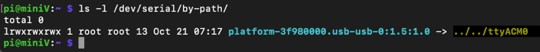

* Copy the corresponding text from your terminal window **platform-3f980000.usb-usb-0:1.5:1.0** and paste it in a text file temporarily.
* Open your configuration file \(nano ~/printer.cfg\) and navigate to the \[mcu\] section. After the text “serial: /dev/serial/by-path/” paste your SKR path so that the line becomes:

serial: /dev/serial/by-path/platform-3f980000.usb-usb-0:1.5:1.0

* Exit the text editor using CNTL-X, and save when asked.
* Take the USB cable from the SKR 1.3 with the Z steppers connected to it and plug this in to another USB port on your Raspberry Pi. \
* Rerun the command “ls -l /dev/serial/by-path/” and note that there are two devices listed, one with a different path than your previous SKR 1.3. Copy this text and save it.
* Open your configuration file and add in your copied text under \[mcu z\] so it looks something like:

serial: /dev/serial/by-path/platform-3f980000.usb-usb-0:1.4:1.0

* Save the configuration file as before.
* Under Octoprint’s Terminal tab type:

FIRMWARE\_RESTART and press enter send the command to restart Klipper.

**NOTE: Pay close attention and complete the remaining configuration checks. If you do not complete these steps, your printer will not run!**

1. Open your printer.cfg file again, and scan through the file. Under \[stepper\_x\], uncomment the position\_endstop and position\_max that corresponds to your printer size. Under \[tmcXXXX stepper\_x\], replace XXXX with either 2208 or 2209 to match the type of TMC drivers that you have. For example, \[tmc2209 stepper\_x\] for TMC 2209 drivers.
2. Repeat step 1 for your \[stepper\_y\] motor.
3. Under \[stepper\_z\], uncomment position\_max for your printer type. You will need to update the TMC configuration with your stepper type for all four Z motors \(Z, Z1, Z2, and Z3\).
4. Under \[extruder\] verify that your sensor\_type is correct. Do not worry about step\_distance and pid values for now, they will be updated later in the setup process. Update \[tmcXXXX extruder\] to match the type of stepper driver you have for your extruder.
5. Under \[heater\_bed\], verify that your sensor type is correct.
6. Under \[quad\_gantry\_level\], uncomment the “gantry\_corners” and “points” sections for your printer size.
7. Under Display, uncomment the display section that matches your display.

Save the configuration file.

• Under Octoprint’s Terminal tab type:

FIRMWARE\_RESTART and press enter send the command to restart Klipper.

The terminal window should show a status “Ready”—if not, type “status” in to the terminal command and press enter. If Klipper says that it is not ready, it will generally notify you if there is a configuration issue that needs to be fixed.

### Common Klipper Errors

**TMC UART Error:** This appears when the communication between the TMC drivers and the SKR 1.3 is not working. Typically this means that you have not powered the SKR board with 12-24V \(TMC drivers didn’t boot\), you haven’t plugged in the TMC steppers to the correct spots, or you forgot to add or remove a jumper as detailed above.

**ADC Error:** ADC stands for “Analog to Digital Converter” and is what is used to convert thermistor readings to temperatures for your hotend and heated bed. As a safety precaution, if Klipper is expecting a thermistor to be plugged in but it is reading an invalid reading \(no thermistor = open, or 0 ohms for a shorted wire as closed\), it will go in to this shut down mode. Double check to make sure your thermistors are plugged in to the correct SKR 1.3 boards and plugs.

**Unable to connect:** Once the underlying issue is corrected, use the "FIRMWARE\_RESTART" command to reset the firmware, reload the config, and restart the host software.

Check MCU IDs match your printer.cfg

"_Make sure you get the paths right”_

### Klipper Troubleshooting

**Retrieve Log File:** The Klippy log file \(/tmp/klippy.log\) contains debugging information.

M112 command in the OctoPrint terminal window immediately after the undesirable event

There is a logextract.py script that may be useful when analyzing a micro-controller shutdown or similar problem.

mkdir work\_directory cd work\_directory cp /tmp/klippy.log .

~/klipper/scripts/logextract.py ./klippy.log

The script will extract the printer config file and MCU shutdown information to work\_directory.

## Klipper Configuration Checks

The moment you’ve been waiting for—your printer finally coming to life! Klipper has a very helpful configuration check guide that will help make sure that everything is operating properly. Please follow the steps detailed at the URL below:

[https://github.com/KevinOConnor/klipper/blob/master/docs/Config\_checks.md](https://github.com/KevinOConnor/klipper/blob/master/docs/Config_checks.md)

### Endstop Check

Make sure that none of the X, Y, or Z Endstops are being pressed, and then send a

QUERY\_ENDSTOPS command via the Octoprint command line. The terminal window should respond with the following:

| Send: QUERY\_ENDSTOPS |  |
| :--- | :--- |
| Recv: x:open y:open z:open |  |

If any of them say “triggered” instead of “open”, double check to make sure none of them are pressed. Next, manually press the X endstop, send the QUERY\_ENDSTOPS command again, and make sure that the X endstop says “triggered” and the Y and Z endstops stay open. Repeat with the Y and Z endstops.

You may find that one of your Endstops has inverted logic \(it displays “open” when it is pressed, and “triggered” when it is not\). In this case, go to your printer’s config file and add or remove the ! In front of the pin. For instance, if your X endstop was inverted, you would add a ! In front of your pin number as follows:

endstop\_pin: P1.28 —&gt; !P1.28

### Stepper Motor Check

To verify that each stepper motor is operating correctly, send the following command:

STEPPER\_BUZZ STEPPER=stepper\_x

Run this again for each of the motors \(stepper\_y, stepper\_z, stepper\_z1, stepper\_z2, and stepper\_z3\). Z motors should go UP first then down. If the stepper motors do not move, check wiring for loose connectors.

### XY Homing Check

It’s time to start by homing X and Y! You’ll want to be able to quickly stop your printer in case something goes wrong \(ie, the tool head goes in the wrong direction\). There are a few ways of doing this—one is to use the E-stop button on your display \(if you have one installed\). Test the button and see what happens—Klipper should shut down, but the Raspberry Pi and Octoprint will still be running, but disconnected from Klipper. Press “Connect” in the upper left corner of Klipper, and then in the Octoprint terminal window send a FIRMWARE\_RESTART command to get your printer back up and running.

The alternative to this is to have your laptop right next to the printer with “restart” already in the terminal command line in Octoprint. When you start homing your printer, if it goes in the wrong direction—quickly send the restart command and it will stop the printer.

The final “nuclear” option is to power off the entire printer if something goes wrong. This is not ideal because doing this may corrupt the files on the SD card and you would have to reinstall everything from scratch.

Now that you know how to stop the printer if something goes wrong, send a G28 X Y command to your printer. This will only home X and Y, not Z. The tool head should move to the right until it hits the X endstop, and then move to the back of the printer until it hits the Y endstop. In a CoreXY configuration, each motor has to move in order to get the toolhead to go in only an X or Y direction \(think of an Etch a Sketch\).

If the toolhead does not go in the correct direction, refer to the table below to figure out how to correct it. If you need to invert one of the motors, invert the direction pin \(put a ! before the pin\). If the motors are going in the directions that match the lower row, swap your X and Y connectors.

\[stepper x\] =&gt; Motor B

\[stepper y\] =&gt; Motor A

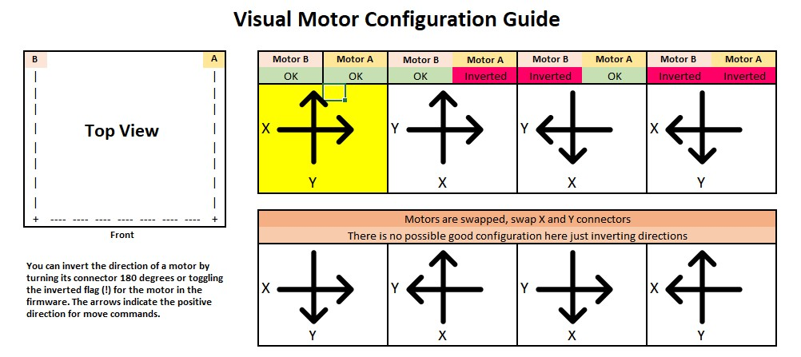

### Define \(0,0\) Point

Home XY

Move the nozzle to the front left corner of the bed. If you can’t reach it, move the bed on the extrusions, but make sure whatever bed position you end up with you can still reach the Z switch. Once you can get the nozzle close to the front left corner of the bed, send an M114 command. If X and Y are not ~0-5mm, update “position\_max” and “position\_endstop” for both \[stepper\_x\] and \[stepper\_y\]:

For X: New = Current – Get Position X Result

For Y: New = Current – Get Position Y Result

If you update anything in your configuration file, save the file and then restart Klipper using

FIRMWARE\_RESTART.

### Z Endstop Pin Location Definition

Run another G28 X Y

Move the nozzle using Octoprint until it is directly above the Z Endstop switch. Send an M114 command and record the X and Y values. Update your homing routine \(homing\_override\] or \[safe\_z\_home\] with these values, then restart Klipper. Run a full G28 and make sure that the printer properly homes X, Y, and Z. If your toolhead is not over the center of the bed at the end of G28, check the printer config file and uncomment the section in \[homing\_override\] that lists your bed size.

### Probe Check

With the probe in the center of the bed, reconfirm that the probe is working correctly. When it is far from the bed, QUERY\_PROBE should return “open”. When a metal object is close to the probe, QUERY\_PROBE should return “triggered”. Slowly reduce your Z height and run QUERY\_PROBE each time until QUERY\_PROBE returns “triggered”—make sure the nozzle is not touching the print surface \(and has clearance\). If the signal is inverted, add a “!” In front of the pin definition \(ie, pin: ! z:P1.24\).

### Probe Accuracy

With the bed and hotend cold \(for now\), move the probe to the center of the bed and run

PROBE\_ACCURACY. It will probe the bed 10 times in a row, and output a standard deviation value at the end. Make sure that the sensed distance is not trending \(gradually decreasing or increasing over the 10 probes\) and that the standard deviation is less than 0.003mm.

Example of unstable PROBE\_ACCURACY \(trending downward during warm up\).

Send: PROBE\_ACCURACY

Recv: // PROBE\_ACCURACY at X:125.000 Y:125.000 Z:7.173 \(samples=10 retract=2.000 speed=2.0 Send: M105

Recv: // probe at 125.000,125.000 is z=4.975000

Recv: // probe at 125.000,125.000 is z=4.960000

Recv: // probe at 125.000,125.000 is z=4.955000

Recv: // probe at 125.000,125.000 is z=4.952500

Recv: // probe at 125.000,125.000 is z=4.950000

Recv: // probe at 125.000,125.000 is z=4.947500

Recv: // probe at 125.000,125.000 is z=4.942500

Recv: // probe at 125.000,125.000 is z=4.937500

Recv: // probe at 125.000,125.000 is z=4.937500

Recv: // probe at 125.000,125.000 is z=4.932500

Recv: // probe accuracy results: maximum 4.975000, minimum 4.932500, range 0.042500, average 4.949000, median 4.948750, standard deviation 0.011948

### Quad Gantry Leveling \(or Z Tilt\)

Run Quad\_Gantry\_Level or Z\_Tilt \(V2.2 or V1.6\). If the script errors out due to an “out of bounds” error, disable your stepper motors and slowly move your gantry or bed by hand until it is approximately flat. Re home your printer \(G28\) and then rerun the sequence. You may have to run it more than once—make sure that the adjustment value for each stepper motor converges to 0. If it diverges, check to make sure you have your stepper motors wired to the correct stepper driver \(check documentation\).

### PID Tune Heated Bed

Move nozzle to the center of the bed and approximately 5-10mm above the bed surface, then run:

PID\_CALIBRATE HEATER=heater\_bed TARGET=100

It will perform a PID calibration routine that will last about 10 minutes. Once it is finished, type SAVE\_CONFIG which will save the parameters into your configuration file.

### PID Tune Hotend

Set the part cooling fans to 25% \(M106 S64\) and then run:

PID\_CALIBRATE HEATER=extruder TARGET=245

It will perform a PID calibration routine that will last about 5 minutes. Once it is finished, type SAVE\_CONFIG which will save the parameters into your configuration file.

### Running Quad Gantry Level with Hot Chamber

Run a G28 command to home the printer since SAVE\_CONFIG restarts your printer.

**Important**: This will be the first time that you have run a Quad Gantry Leveling at a high chamber temperature. To make sure that your probe has stabilized with the heated bed at 100C and the extruder at 240C, run PROBE\_ACCURACY with the nozzle in the center of the bed. If the values are trending \(increasing or decreasing\) throughout the 10 probes, or the standard deviation is greater than 0.003mm, wait another 5 minutes and try again. Once the readings are stable, run

QUAD\_GANTRY\_LEVEL. Make a note of how long it took for your probe readings to stabilize and remember this for the next time you start your print—you’ll typically want to wait 10-20 minutes from a cold printer to your first print to make sure temperatures stabilize.

### Z Offset Adjustment

If you did not run PID tuning, set your extruder to 245C and heated bed to 100C and let the printer heat up for 15 minutes.

Run a G28, and then a Quad\_Gantry\_Level, and then another G28. Move the nozzle to the center of the bed

Run Z\_ENDSTOP\_CALIBRATE

Slowly move the nozzle toward the bed by using TESTZ Z=-1

Until the nozzle is relatively close to the bed, and then stepping down with TESTZ Z=-0.1

Until the nozzle touches a piece of paper on top of the build plate. If you go far down, you can move the nozzle back up with: TESTZ Z=0.1

Once you are satisfied with the nozzle height, type “ACCEPT” and then “SAVE\_CONFIG”.

If you get an error \(out of bounds\), send Z\_ENDSTOP\_CALIBRATE, ACCEPT, and then

SAVE\_CONFIG. This will redefine the 0 bed height so you will be able to get closer. However, if you get this error it likely means that the shaft for your Z Endstop is too long, and may catch on the print head during a print. It is best to cut the shaft so that it is flush with the top surface of your PEI.

### Extruder Calibration

Before your first print, you need to make sure that your extruder extrudes the correct amount of material. With the hotend at temperature, make a mark between your roll of filament and your extruder, 120mm away from the entrance to your extruder. In Octoprint, extrude 50mm 2 times \(for a total of 100mm—Klipper doesn’t allow you to extrude more than 50mm at a time\), then measure from the entrance of your extruder to the mark you made previously. In a perfect world, it would measure 20mm \(120mm - 20mm = 100mm\), but it usually won’t be. Take the value you have in your configuration file and update it using the following:

New Config Value = Old Config Value \* \(Actual Extruded Amount/Target Extruded Amount\)

Note that a higher configuration value means that less filament is being extruded.

Paste the new value into your configuration file, restart Klipper, and try again. Once your extrusion amount is within 0.5% of the target value \(ie, 99.5-100.5mm for a target 100mm of extruded filament\), your extruder is calibrated!

### Fine Tuning Z Height

As a reference, if you adjust the Z offset during a print using the Tune menu on your display, you can

update your printer configuration with this new value. Remember that higher values for your Z\_endstop\_position mean that the nozzle will be closer to the bed.

New Position = Old Position - Tune Adjustment

New Position = Old Position - \(-0.050\) = Old Position + 0.050

## Slicer Setup and First Print

### Cura Installation

For your first print, use the latest version of Cura, but do not open it at first. Download the latest Voron Cura setup files pinned in \#slicers\_and\_print\_help, and then extract the zip folder into C:\Program Files\Ultimaker Cura X.X\resources.

Once that is complete, open Cura and under “non-networked printer” find the Voron tab and select the size of your printer. All the settings should be pre-populated for you.

### First Print

Download the “voron\_design\_cube\_v6.stl” from the Voron Github page \(Voron-2/STLs/

TEST\_PRINTS\), and open the file in Cura. Use the default slicer settings, but make sure the hotend temperature and bed temperature is correct for the filament you are using. A good starting point is 240C hotend temperature, 100C heated bed temperature, and 92% flow for ABS.

Slice the file and save the .gcode file to your desktop \(if you haven’t set up the Octoprint Plugin\). Navigate to Octoprint in your web browser, and upload the file to Octoprint. Press “Print” and closely watch the beginning of the print. If your nozzle is too far or close to the bed, on your printer display press the knob, navigate to “Tune”, and adjust the Z offset distance \(+ is further from the bed, - is closer\).

Once you are printing \(with your printer fully assembled\), take a quick video, upload it to the Voron subreddit and eat a well deserved bowl of cereal!

## Appendix

### Appendix 1 - Notepad++ Configuration Editing \(Windows\)

1. Install Notepad++ from: [https://notepad-plus-plus.org](https://notepad-plus-plus.org/)
2. Under the “Plugins” tab, select “Plugins Admin”
3. Search for “NppFTP”, select the check box, and click “Install”
4. Restart Notepad++ if necessary
5. On the right, there will be a new section. Click the gear icon and select “Profile Settings”

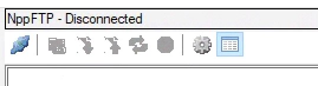

1. In the bottom left, select “Add New” and name the profile as you wish
2. In the Hostname dialog, enter the IP address of your Raspberry Pi
3. In Connection Type, select SFTP
4. Port: 22
5. Username: pi
6. Password: \*\*\* \(default is raspberry\)
7. Close the dialog box, select the blue symbol, and select the name of the profile you created
8. Notepad++ will connect to your Raspberry Pi and display the file structure
9. Navigate to /home/pi and open printer.cfg
10. Make any applicable edits and then save the file

Remember to restart klipper from the Octoprint terminal to see your changes take affect!

### Appendix 2 - bbEdit Configuration Editing \(macOS\)

1. Install bbEdit. The free version works great! [https://www.barebones.com/products/bbedit/](https://www.barebones.com/products/bbedit/)
2. Under File, select Open from FTP/SFTP Server…”
3. Under Server, type in your Raspberry Pi’s IP address \(will be different\)

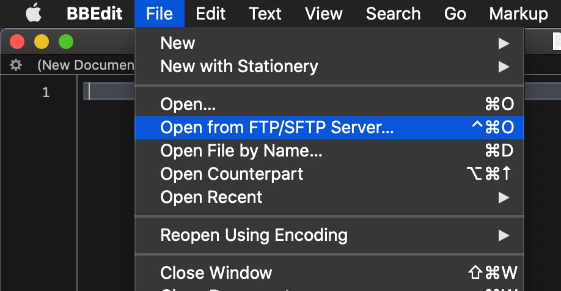

1. Select SFTP
2. Enter “pi” as the user
3. Enter your password, it will be “raspberry” unless you changed it.
4. Select Continue

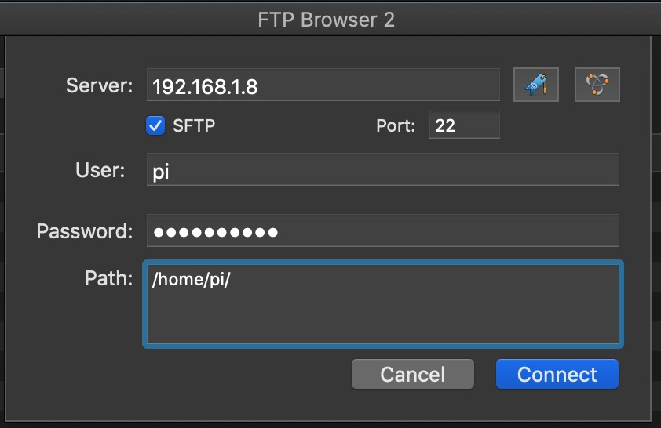

1. Find “printer.cfg” in the file browser and double click to open the file
2. Make any necessary edits and save the file

Remember to restart klipper from the Octoprint terminal to see your changes take affect!

### Appendix 3 - Recommended Octoprint Plugins

* OctoKlipper
* Themeify
* TerminalCommands
* Bed Level Visualizer
* Print Time Genius

### Appendix 5 - Other Accessories

To add LED lights inside the enclosure, wire up the \(+\) side of the LEDs to a power supply that matches the LED rated voltage, and the \(-\) side of the LEDs to one of the H-Bed \(Heated Bed\) connectors on either MCU. Define this output in your klipper configuration file and install an Octoprint plugin to control these LEDs.

### Appendix 6 - Contributors

* eddie V2.058
* chron V2.226
* Iakabos V2.067
* fermion V2.202
* Timmitt V2.003
* insurgus V2.278
* Defib V2.213
* newb
* mjoaris

