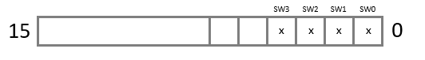

# STPM API Document V1.2

#### Default Format (regAddr, Param1Value, Param2Value.....)

## Setup Commands

* `Limit SW Association M0 (0x02, assoc)   REG(R/W)`

* `Limit SW Association M1 (0x03, assoc)   REG(R/W)`

.png>)

* `Homing Setup M0 (0x04, direction)   REG(R/W)`
  * x is equal to the direction a motor must move to reach the specified limit switch

.png>)

* `Homing Setup M1 (0x05, direction)   REG(R/W)`
  * x is equal to the direction a motor must move to reach the specified limit switch

.png>)


The goal of the above setup commands should allow a user to say home to SW3 and it knows exactly which motors and which direction to proceed in until the switch is activated


## Read Commands

* `Query Endstips (0x15)   REG(Read)`
  * Returns the following

.png>)

* `Query Position (0x16)   REG(Read)`
  * Returns a value for each motor corresponding to steps from 0 point

## Control Commands

* `Calibration or Zero (0x06, FirstSW, SecondSW, ThirdSW, FourthSW)`
  * FirstSW, SecondSW, ThirdSW, FourthSW = the limit switch one wishes to calibrate
    * 0x00 = SW0
    * 0x01 = SW1
    * 0x02 = SW2
    * 0x03 = SW3
    * 0x04 = Blank&#x20;


The goal of the**`Calibration or Zero`**command is to allow the user to zero all,  a few, or individual limit switches in a specific order


* `cmdBfrWrite(0x08, directionSelect, M0Steps, M1Steps)`
  * directionSelection:

.png>)

&#x20;                               M0Steps- numerical value of steps

&#x20;                               M1Steps- numerical value of steps


Set M0Steps or M1Steps to 0 in order to not move that specific motor


* `cmdBfrClear(0x20, anything)`

&#x20;                               anything- can pass any value

&#x20;  movementType - Relative: 0x00,   Absolute: 0x01&#x20;
