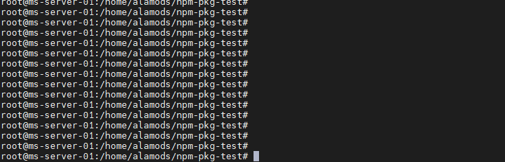

# List of NPM packages

#### inquirer- A collection of common interactive command line user interfaces 

## Boxen- command line box maker



#### Create boxes in the terminal








## prompts- simple command line interface \(questions\)











#### Enquirer- command line interface

#### fs-extra- extra fs use

#### 

