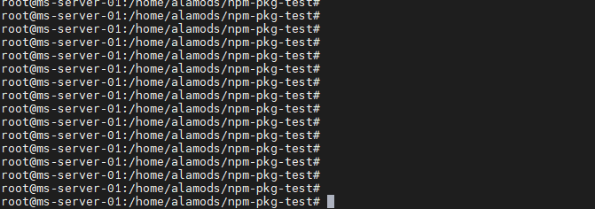
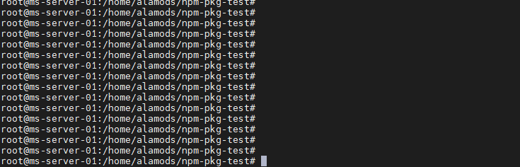
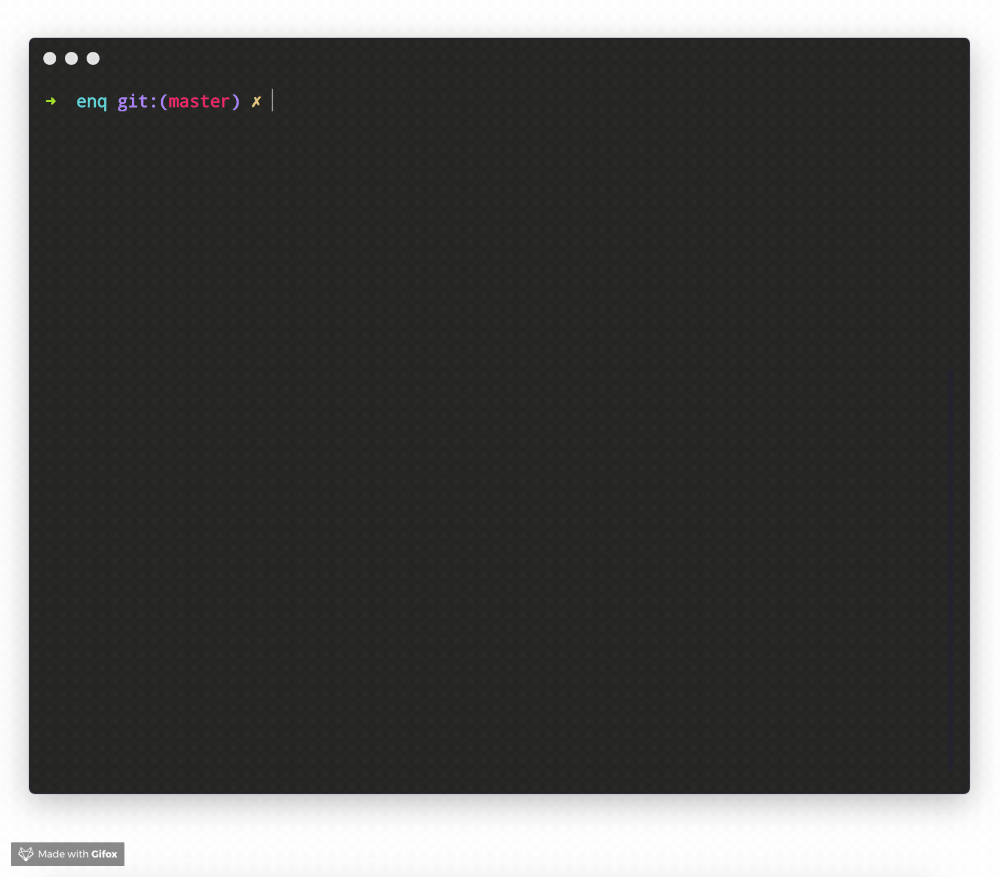
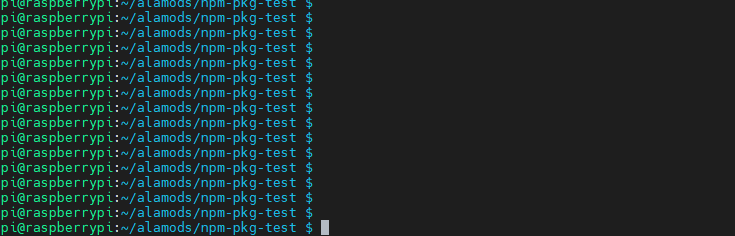

# List of NPM packages

## Boxen- command line box maker



#### Create boxes in the terminal








## Prompts- simple command line interface \(questions\)











## Progress- simple node progress bar











## Config- .JSON configuration files 











## Enquirer- command line interface











## Inquirer- A collection of common interactive command line user interfaces











##  Figlet- Ascii text generator











## Minimist- handles command line arguments











#### 









#### 

