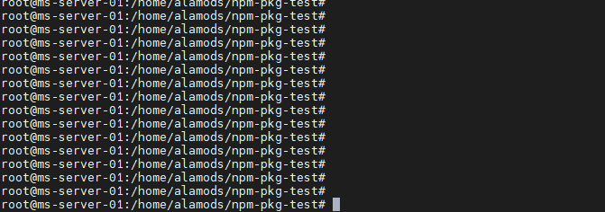
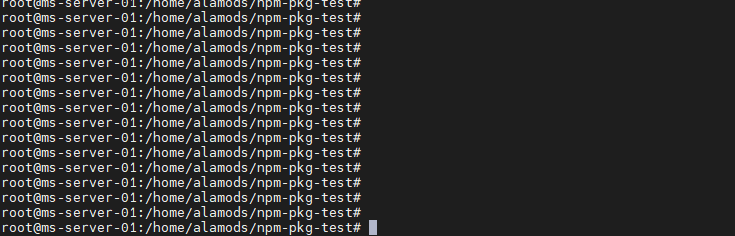
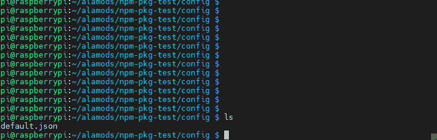
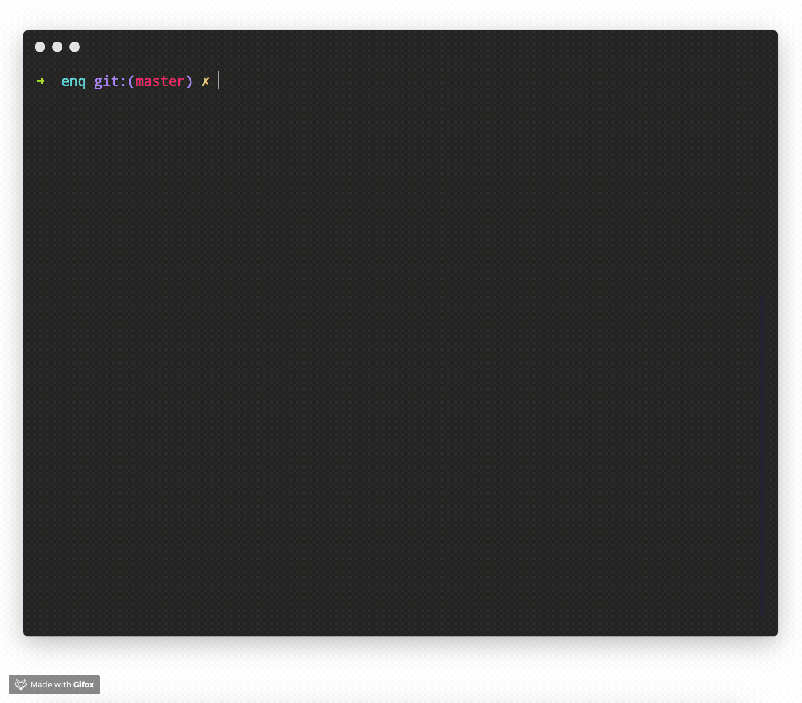
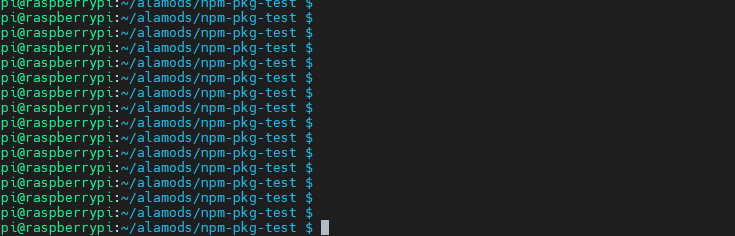
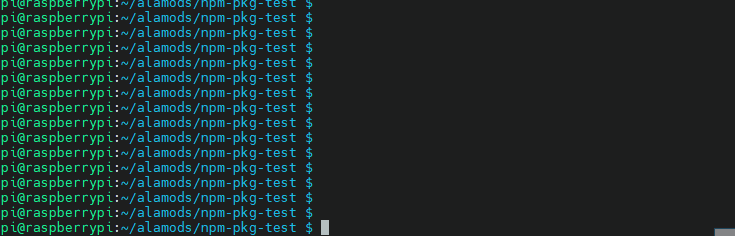
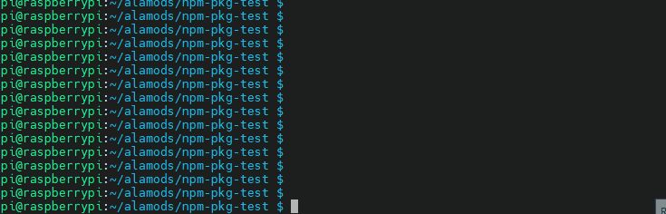

# List of NPM packages

## RPIO



```javascript
var rpio = require('rpio');

rpio.init({gpiomem:    false, mapping:    'physical'}); //Physical pin mapping
rpio.open(7, rpio.OUTPUT, rpio.HIGH); //Setting GPIO 7 as an Output and default High
rpio.open(35, rpio.INPUT); 


```







## Help- Handles "-h, --help" CLI commands



```javascript
//Put information to return in usage.txt file

var help = require('help')('usage.txt')
var args = process.argv.splice(2)
if (args[0] === '-h' || args[0] === '--help' || args[0] === 'help') {
    // process prints contents of `usage.txt` and returns
    return help()
}

// the first arg must be a number
if (isNaN(args[0])) {
    // process prints contents of `usage.txt` and exits with code 1
    return help(1)
}
```







## Simple JSONdb- A simple, no-frills, JSON storage 



```javascript
const JSONdb = require('simple-json-db');
const db = new JSONdb('/path/to/your/database.json');

//Set a key
db.set('key', 'value');
//The key parameter must be a string, value can be whatever kind of 
//object can be stored in JSON format. JSON.stringify() is your friend!

//Get a key
db.get('key');
//The key parameter must be a string. If the key exhists its value is 
//returned, if it doesn't the function returns undefined.

//Check a key
db.has('key');
//The key parameter must be a string. If the key exhists true is returned,
//if it doesn't the function returns false.

//Delete a key
db.delete('key');
//The key parameter must be a string. The function returns as per the 
//delete operator if the key exhists, else it returns undefined.

//Sync to disk
db.sync();
//This function writes the JSON storage object to the file path 
//specified as the parameter of the main constructor. Consult 
//the Options section for usage details; on default options there 
//is no need to manually invoke it.

//Access JSON storage
db.JSON();
//This will return a copy of the internal JSON storage object, for 
//you to tinker with and loop over.

//Replace JSON storage
db.JSON({ data });
//Giving a parameter to the JSON function makes the object passed 
//replace the internal one. Be careful, as there's no way to recover 
//the old object if the changes have already been written to disk.
```







## Idea- A lightweight CLI tool and module for keeping ideas in a safe place quick and easy



```javascript
npm install --global idea

$ idea --help
idea help
usage: idea [command] <idea|filter|id>

A lightweight CLI tool and module for keeping your ideas in a safe place quick and easy.

[command]
  create <idea>           Creates and saves a new idea. Example: `idea create "Implement something very cool"`
  list                    Lists all ideas. Example: `idea list`
  filter <filter>         Lists filtered ideas. Example: `idea filter '{"state": "SOLVED"}'`
  solve <id>              Solves an idea. Example `idea solve 1`
  help                    Prints this help.

Documentation can be found at https://github.com/IonicaBizau/idea
```







## Boxen- command line box maker



#### Create boxes in the terminal









## Prompts- simple command line interface \(questions\)











## Progress- simple node progress bar











## Config- .JSON configuration files 











## Enquirer- command line interface













## Inquirer- A collection of common interactive command line user interfaces











##  Figlet- Ascii text generator











## Minimist- handles command line arguments











#### 






















#### 


